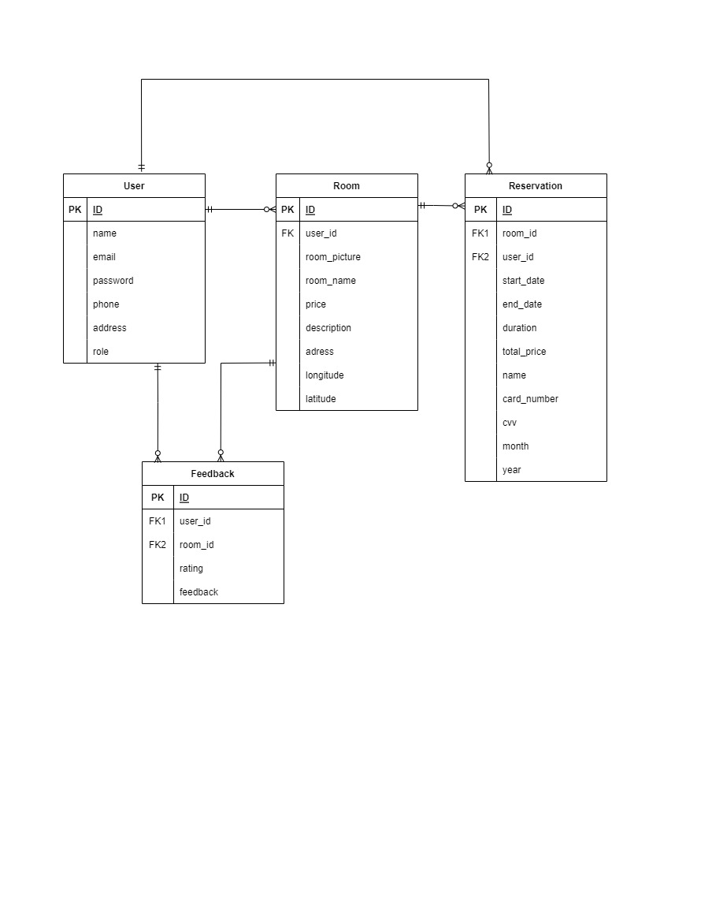

## 💫 About
<p align="justify">Similiar to airbnb. User can be a host to make their own homestay and user can book the host homestay.<br>
  <br>
This RESTful API was developed by using Golang and written based on Clean Architecture principles. Built with Echo as web framework, GORM as ORM, MySQL as DBMS, etc.
</p>

## 🛠 Tools
**Backend:** <br>


**Deployment:** <br>


**Communication:**  


# 🔗 ERD


# 🔥 Open API

Simply [click here](https://app.swaggerhub.com/apis-docs/ALIFMUHAMADHAFIDZ23/Air-BNB/1.0.0) to see the details of endpoints we have agreed with our FE team.

<details>
  <summary>👶 User </summary>
  
| Method      | Endpoint            | Params      |q-Params            | JWT Token   | Function                                |
| ----------- | ------------------- | ----------- |--------------------| ----------- | --------------------------------------- |
| POST        | /register           | -           |-                   | NO        | Register a new Use                |
| POST        | /login              | -           |-                   | NO          | Login to the system                     |
| GET         | /users          | -           |-                   | YES         | Show user profile                    |
| PUT         | /users         | -           |-                   | YES         | Update user profile                  |
| DELETE         | /users          | -           |-                   | YES         | Deactivate User                   |
| POST         | /users/upgrade       |  |-                   | YES         | make user to host role                   |

  
</details>

<details>
  <summary>🏘 Room</summary>
  
| Method      | Endpoint            | Params      | JWT Token   | Function                                |
| ----------- | ------------------- | ----------- | ----------- | --------------------------------------- |
| POST        | /rooms              | -           | YES          | Post a rooms as a host                    |
| GET         | /rooms   | -    | YES          | Get All Available room  |
| GET         | /rooms   | rooms_id    | YES          | Get Rooms Detail |
| PUT         | /rooms   | rooms_id    | YES          | Edit Room |
| DELETE       | /rooms   | rooms_id    | YES          | Delete Room |
 | GET         | /users/user_id /rooms  | user_id    | YES          | Get All user room |

  </details>
     <details>
  <summary>📠 Reservation</summary>
  
| Method      | Endpoint            | Params      | JWT Token   | Function                                |
| ----------- | ------------------- | ----------- | ----------- | --------------------------------------- |
| POST        | /reservations/check             | -           | YES          | To Check Room Availability                    |
      | POST         | /reservations   | -    | YES          | Make User Reservation |
| GET         | /reservations   | -    | YES          | Get User Reservation |


  </details>
  <details>
   <summary>🔊 Feedback</summary>
  
| Method      | Endpoint            | Params      | JWT Token   | Function                                |
| ----------- | ------------------- | ----------- | ----------- | --------------------------------------- |
| POST        | /feedbacks             | -           | YES          | To Make a Room Feedback from User                    |
| GET       | /feedbacks             |           | YES          | Get User Feedback                    |
| GET       | /feedbacks/feedback_id             | feedback_id          | YES          | Get User Feedback Detail                    |
| GET      | /rooms/rooms_id/feedback         | rooms_id          | YES          | Get User Feedback In Room Detail                   |
| PUT      | /feedbacks            | feedback_id          | YES          | Edit User Feedback                   |


  </details>
    
 ## 👨🏽‍💻 Clone Repo
```shell
git clone https://github.com/TIMESYNC-Project/GroupProject3-Airbnb-Api
```

## 🎯 Run Project
```shell
go run .
```

## 🚀 Tech Stack
### 🧰Backend
- [Github Repository for the Backend team](https://github.com/Alta-Project3/GroupProject3-Airbnb-Api)
- [Swagger OpenAPI](https://app.swaggerhub.com/apis-docs/ALIFMUHAMADHAFIDZ23/Air-BNB/1.0.0)

### 🧰Frontend
- [Github Repository for the Frontend team](https://github.com/Alta-Project3/GroupProject3-Airbnb-App)
- [Figma](https://www.figma.com/file/zdRtmaAmCsmLGG2b4IioRP/Group-Project-3-Air-Bnb?node-id=0-1&t=PdQQ8RY7Zp6CBCGU-0)

# 😎 Author
-  Findryan Kurnia Pradana  <br>  [](https://github.com/Findryankp)
-  Alif Muhamad Hafidz <br>  [](https://github.com/AlifMuhamadHafidz)
